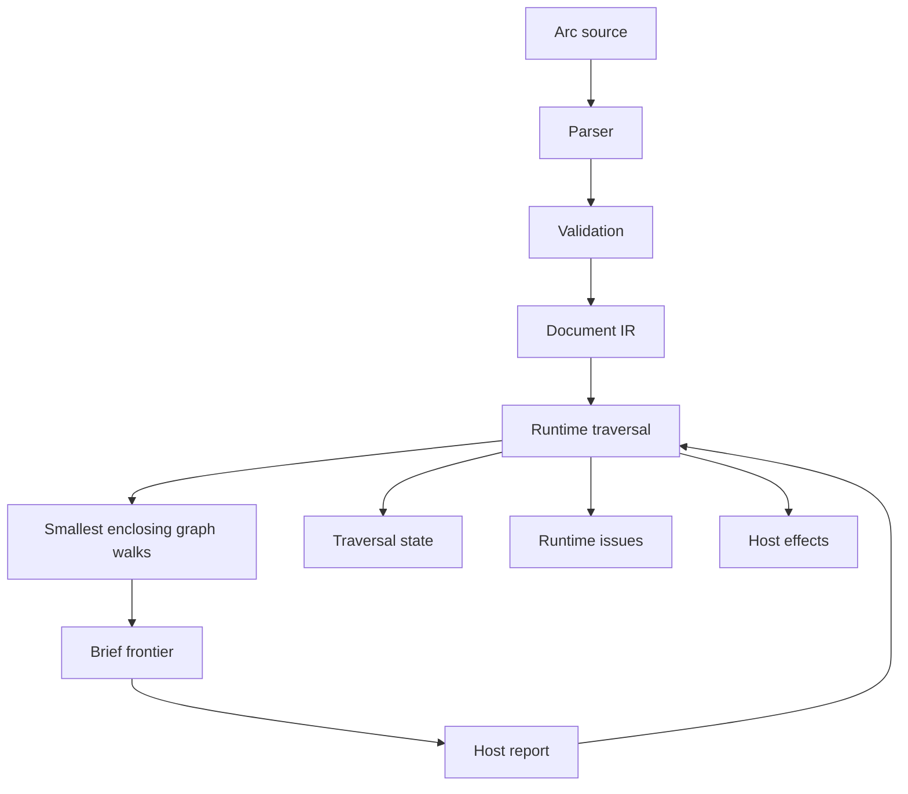

# Internal Semantics

This document is the implementer/user-facing reference for Arc parser and runtime behavior. When implementation details conflict with this document, treat the implementation as incomplete unless this document is first updated with the new intended semantics.

## Parser Behavior

The parser serves Arc language semantics. It must not reject a coherent language feature merely because the current implementation shape makes it inconvenient.

Parsing recognizes Arc source and constructs Arc IR. Parse-time `Error`s are appropriate when source cannot be represented as Arc IR at all: unsupported forms, invalid hook shapes, malformed call syntax, unsupported option object shapes, non-template semantic text, or other syntax-shape violations.

Validation checks semantic references and cross-IR constraints after IR exists. `ValidationIssue` is appropriate for unknown variables, unknown nodes, duplicate labels, illegal channel references, invalid template interpolation contents, and other constraints that can be checked on normalized IR.

`parse(source)` is allowed to throw the first validation issue as an `Error` for convenience, but `validate(document)` is the structured interface for validation results.

Do not duplicate the same rule as both an eager parse-time `Error` and a later validation issue unless the parse-time check is needed to construct well-formed IR. Prefer building IR, then validating semantic references.

## Parser Semantics

Shared authored forms should have one coherent interpretation. Equivalent syntax must not drift into incompatible semantics just because it appears in a different construct.

Target expressions are one example. `enter(Target)`, `enterLoop(Target)`, and `deflection.from(Target)` may allow different target shapes, but a bare target should mean the same structural reference in each place: a local child node or local import binding resolved by Arc reference-name rules.

Scoped reserved names are acceptable when they are local to a coherent authored construct. `args` and `returns` are local channel namespaces inside node bodies. `deflection` is local to `this.catchDeflection`. Global namespaces such as `State` and `Dialog` are document-wide.

Scoped language forms should be available only in their intended authored scope. Outside that scope they should fail clearly rather than silently becoming ordinary variables or unrelated expressions.

## Runtime Error Handling

Runtime APIs distinguish caller misuse from authored execution failure.

Caller/API misuse throws. Examples include duplicate document registration, unknown arc references passed to `newTraversal(...)`, unknown brief object identity passed to `progress(...)`, and invalid root traversal phase passed to `start(...)`.

Host report protocol problems do not throw once a known brief is supplied. Illegal moves, unknown brief ids, invalid judgment values, and invalid observation payloads are surfaced as `RuntimeIssue` entries on the next brief. A rejected report replans from the previous accepted snapshot.

Authored execution failures are caught at runtime advancement boundaries and converted to `RuntimeIssue { kind: "poisoned-traversal", reasonCode: "runtime-error" }`. In action progression, the active root traversal becomes `phase: "poisoned"`. In trigger probing, the poisoned candidate is recorded and probing continues for other arcs.

Since the runtime does not execute host effects, host effect delivery failures are outside the runtime contract.

## SEG Semantics

A smallest enclosing graph, or SEG, is the smallest local statement graph that owns rewalk behavior. Node action bodies, hook arrow-function bodies, effect bodies, trigger bodies, and resolution hook bodies are separate SEGs.

Rewalk is scoped to the current SEG. When a leaf action resolves after changing traversal-visible state or callee outcome state, traversal restarts from that SEG root so branch reachability is recomputed under the updated state. It does not resume from a stored statement pointer inside the prior walk.

Structural control flow belongs to the SEG walk. `if`, `label`, and `break` are evaluated against current traversal state and frame state. Leaf statements supply their own semantics, but they do not own the surrounding graph walk.

Resolved leaf actions are skipped by frame state. Branch conditions are reevaluated whenever the walk reaches them. Arc progression is graph reinterpretation under updated state, not call-stack continuation.

Instruction batching is scoped to the currently executing node body. Entering a child through `enter(...)` or `enterLoop(...)`, returning to a caller, or beginning `this.effects` ends the current instruction batch.

## Traversal Finalizing

Traversal finalizing is runtime state for completing a node outcome after the node action graph can no longer make ordinary progress.

Finalizing must be persisted in traversal state whenever it blocks on a briefable action. A later runtime call must resume the same finalizing phase, not restart the node body.

Covered finalizing sequence: enter finalizing with `reason: "covered"`; run effects; clear finalizing; set node state to `State.COVERED`; let the parent `enter(...)` action resolve. The target is not fully covered for caller progression until effects finish.

Deflected finalizing sequence: enter finalizing with `reason: "deflected"` and `phase: "catch"`; run `this.catchDeflection`; if it returns true, clear finalizing and rewalk this node's SEG without setting this node to deflected; otherwise set this node to `State.DEFLECTED`, switch to effects, run effects, clear finalizing, and propagate deflection to the parent.

Effects are part of finalization. They may block and resume through normal brief/report progression.

## Deflection Propagation

Deflection originates at the active node or instruction frontier. The originating traversal remains the triggering deflection source.

A node's `this.catchDeflection` catches only that node's own deflection. It does not erase the triggering child's deflected state.

If a child deflects and the parent does not catch, the parent becomes deflected after its own catch opportunity fails. This propagation repeats upward until some ancestor catches or the root becomes deflected.

If an ancestor catches, that ancestor becomes the active traversal and rewalks its own SEG. Already persisted child outcomes remain visible unless the action graph explicitly changes state through normal Arc operations.

`deflection.from(Target)` v1 compares against a bare node/import target. It does not accept `fresh(Target)` or `reopen(Target)`.

## Brief And Report Invariants

Brief objects are ephemeral capability objects. The host must pass the exact brief object instance back to `progressTrigger(...)` or `progress(...)`; cloned or reconstructed objects are invalid.

The traversal set included in each brief is the persistence boundary. Hosts should persist traversal state after each brief is issued, including briefs that contain host effects or runtime issues.

Reports are interpreted against the originating brief snapshot. Unknown ids are protocol issues, not dynamic lookups into the current traversal.

`allowedMoves` is authoritative. A host may only report moves listed on the brief. The runtime validates this before applying report data.

`hostEffects` are append-only output for the host to handle after a brief is issued. They are not hidden continuations and do not imply that runtime traversal has progressed beyond the returned brief.

## Runtime State Invariants

Canonical node traversals are addressable through `ReferenceName.state`. Fresh traversals are ephemeral and are not addressable from Arc source. Reopened traversals replace the canonical traversal outcome for the referenced node or arc.

Node state records the terminal outcome visible to parents. Node frame state records resolved actions inside the node. These are separate concepts and must not be collapsed.

`this.resumable = false` clears frame progress on re-entry without clearing variable values, child traversal state, or canonical node outcomes.

The active traversal is derived from runtime progression. It should identify the traversal currently owning the frontier represented by the brief. It is not an independent host-persisted control pointer.

Runtime implementations must not rely on hidden in-memory continuation state for correctness. Persisted traversal state plus the registered documents must be sufficient to resume after a brief/report boundary.

## Testing Expectations

Every semantic rule in this document should have test coverage.

Parser tests prove syntax acceptance, syntax rejection, IR shape, and validation issues. Runtime tests prove traversal state, rewalk behavior, brief shape, report validation, effects, deflection propagation, and poisoning behavior.

When a test is adjusted during a semantic change, verify whether the old failure exposed a real bug. Do not weaken a test to match implementation behavior unless the spec intentionally changed.

Deflection behavior requires coverage for root propagation, owned children, imported children, ancestor catching, self catching, false catching, resumed catching, root retriggering, effects on caught and uncaught paths, and invalid `deflection.from(...)` targets.
