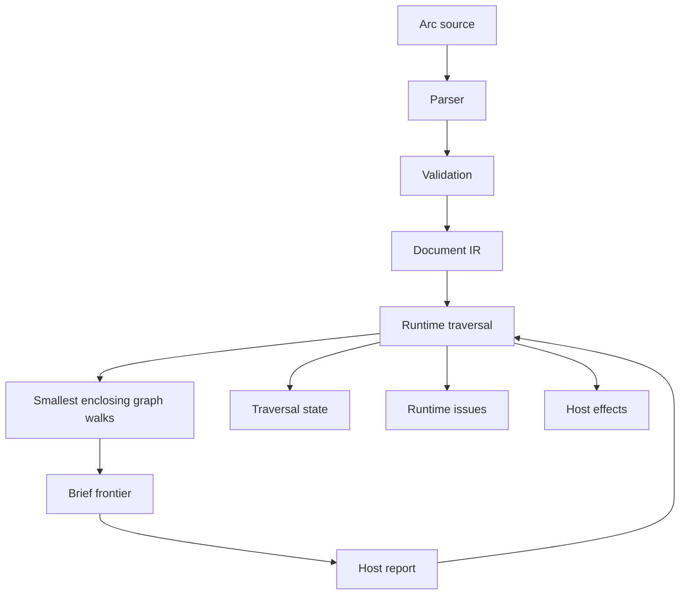

# Internal Semantics

This document is the implementer/user-facing reference for Arc parser and runtime behavior. When implementation details conflict with this document, treat the implementation as incomplete unless this document is first updated with the new intended semantics.

```mermaid
graph TD
  Source[Arc source] --> Parser[Parser]
  Parser --> Validation[Validation]
  Validation --> IR[Document IR]
  IR --> Runtime[Runtime traversal]
  Runtime --> SEG[Smallest enclosing graph walks]
  SEG --> Brief[Brief frontier]
  Brief --> Host[Host report]
  Host --> Runtime
  Runtime --> State[Traversal state]
  Runtime --> Issues[Runtime issues]
  Runtime --> Effects[Host effects]
```

## Parser Behavior

The parser serves Arc language semantics. It must not reject a coherent language feature merely because the current implementation shape makes it inconvenient.

Parsing recognizes Arc source and constructs Arc IR. Parse-time `Error`s are appropriate when source cannot be represented as Arc IR at all: unsupported forms, invalid hook shapes, malformed call syntax, unsupported option object shapes, non-template semantic text, or other syntax-shape violations.

Validation checks semantic references and cross-IR constraints after IR exists. `ValidationIssue` is appropriate for unknown cells, unknown nodes, duplicate labels, illegal channel references, invalid template interpolation contents, and other constraints that can be checked on normalized IR.

`Dialog.user` and `Dialog.self`, along with their `user` and `self` shorthands, lower to the same semantic `ref` parts. The distinction is authored syntax only and does not survive in IR.

`parse(source)` is allowed to throw the first validation issue as an `Error` for convenience, but `validate(document)` is the structured interface for validation results.

Public `Document` IR is a trust boundary. `validate(document)` must cover every semantic invariant needed to run a hand-crafted or deserialized document safely, including target binding, scoped expression legality, and duplicate bindings. The parser may also reject the same rule eagerly when doing so is needed to construct IR or gives clearer authored-source diagnostics; shared helpers are preferred where a rule is naturally common.

## Parser Semantics

Shared authored forms should have one coherent interpretation. Equivalent syntax must not drift into incompatible semantics just because it appears in a different construct.

Target expressions are one example. `$enter(Target)`, `$enterLoop(Target)`, and `this.deflection.escaped(Target)` may allow different target shapes, but a bare target should mean the same structural reference in each place: a local child node or local import binding resolved by Arc reference-name rules.

Scoped reserved names are acceptable when they are local to a coherent authored construct. `args` and `returns` are local channel namespaces inside node bodies. `span` is a local namespace inside a `$map` callback, carrying that member's `item`, `index`, and `result`. Global namespaces such as `State` and `Dialog` are document-wide.

Scoped language forms should be available only in their intended authored scope. Outside that scope they should fail clearly rather than silently becoming ordinary cells or unrelated expressions.

## Element Ids

Every statement and every briefable expression carries one identity, the element id, and it is structural: the element's position within its SEG scope, prefixed by the scope's owner chain. No allocator exists — ids are derivable from document shape alone. A scope is a SEG: the node-lifecycle scopes (`body`, `guard`, `effects`, `trigger`, `catch`, and the node-level `deflectWhen` declaration), an owned hook scope (`<ownerId>/resolveWhen`, `<ownerId>/deflectWhen`), or an invoke body or `$map` callback (the invoke's or the `$map` statement's own id is the scope). Within a scope, a step is a sibling index with a branch tag (`c` consequent, `a` alternate, `l` label body) on every non-terminal step, and briefable expressions inside one statement take the statement's id plus `~n` in evaluation order. Examples: `body/0c/1`, `guard/0`, `body/2/0` (first statement of the invoke at `body/2`), `body/3/resolveWhen/0`, `body/0~0`.

The branch-tag invariant makes ids injective: an untagged step always ends its scope's local path, so whatever follows unambiguously opens a nested scope. Ids are node-relative — every node has a `body/0` — and anything crossing nodes pairs the id with a node ref (brief ids, enter continuations, anonymous-copy refs). The alphabet excludes `.` `:` `[` `]` `#`, so an id embeds safely in refs and brief ids. Consumers never parse ids; the single sanctioned manipulation is the inherited-hook brief-site prefix substitution described under Runtime State Invariants.

Scoping is what makes ids stable: editing one SEG never shifts another SEG's ids, so an added effects hook leaves every body id — and every brief id and persisted record key built from them — unchanged. The accepted residue is local: an edit earlier in the same branch shifts the ids of later siblings (and, transitively, scopes nested under them), and an edit to a statement's expressions renumbers that statement's `~n` suffixes. Both stay confined to the edited region.

`stampElementIds(node)` is the canonical stamper: it derives every id from shape, writes it in place, and rebuilds `newcopyAliases` (which embed enter-statement ids). Stamping is idempotent. `parse(...)` stamps its own output; `Runtime.add(...)` stamps its private clone, so hand-built IR registers without a manual step; `validate(...)` / `analyzeDocument(...)` only verify — a non-canonical or unstamped id is a validation issue, never a silent repair, and the input is never mutated. An inherited `deflectWhen` is stamped under the static `deflectWhen/` scope, never the owning instruction's: re-stamping a genuinely shared hook array rewrites the same ids, and stamping a clone-severed private copy is what makes it canonical.

## Runtime Error Handling

Runtime APIs distinguish caller misuse from authored execution failure.

Caller/API misuse throws. Examples include duplicate document registration, unknown arc references passed to `newTraversal(...)`, unknown brief object identity passed to `progress(...)`, and invalid root traversal phase passed to `start(...)`.

Host report protocol problems do not throw once a known brief is supplied. Illegal moves, unknown brief ids, invalid judgment values, and invalid observation payloads are surfaced as `RuntimeIssue` entries on the next brief. A rejected report replans from the previous accepted snapshot.

Authored execution failures are caught at runtime advancement boundaries and converted to `RuntimeIssue { kind: "poisoned-traversal" }`. A known throw site supplies a stable cause-specific `reasonCode`; an uncategorized exception uses `other-runtime-error`. In action progression, the active root traversal becomes `phase: "poisoned"`. In trigger probing, the poisoned candidate is recorded and probing continues for other arcs.

The runtime does not execute host effects, so handler execution and delivery failures are host-owned. The emitted effect record is still part of the action frontier contract: if the host cannot accept that contract at all, for example because no implementation exists for the referenced host module, it may report `move: "poison"`. Once the host handles an effect, it reports the effect's brief id with `status: "applied"` and the runtime resolves the effect statement.

## SEG Semantics

A smallest enclosing graph, or SEG, is the smallest local statement graph that owns a structural walk, resolved-once action state, and a pin tape. Node bodies, lifecycle and action hooks, effects, triggers, invoke bodies, and map-member callbacks are separate SEGs.

### Walk state

A SEG walks its statements through an explicit frame stack. `if`, `label`, and `break` shape that stack; leaf statements act at the current position. When an action resolves, the walk advances to the following statement. Decisions and evaluations already crossed remain pinned, while later evaluations observe updated state and append to the same tape.

Each resolved-once action occurrence has one frame slot: absent before reach, pending while blocked at the frontier, and resolved after settlement. Authored `$` forms such as `$enter(...)`, `$observe(...)`, `cell.$set(...)`, and host effect `Memoir.facts.$apply(...)` use these slots and resolve once per SEG instance. A grouped `$observe({ ... })` is one slot and writes all `resolved` fields atomically before advancing; an invalid or incomplete report writes nothing and re-emits the group.

Expressions have no resolved-once slot. Every non-constant sigil-less evaluation — including judgments, host calls, `Dialog.*`, cell/channel/outcome reads, and invocation completions — records its value on the SEG's pin tape when first reached. The tape is keyed by statement element id and evaluation order, so resume can replay the exact route without re-reading state that may have changed while frontier work settled. Reported judgment and host-call values hydrate their pending tape entries. Action-traversal tapes persist with traversal state and therefore survive runtime reconstruction.

Cell-writing and observation actions carry a `CellTarget`: one lexical root name followed by local-expression accessors into its inner value. The runtime resolves those accessors before evaluating a `$set(...)` value or emitting/consuming an observation. Non-constant accessors therefore pin on the same statement tape, fixing a dynamic target such as `items[index]` across suspension and process reconstruction without separate action continuation state. An array-element write validates the scalar leaf, clones the live root array, replaces the selected existing position, and commits the complete array through the ordinary owned-cell write path before the SEG advances.

### Suspension and resume

A SEG suspends when its walk reaches unresolved frontier work that requires host coordination and yields a brief. Applying a report resumes the action at that boundary: a valid report settles the pending work, while a report that does not settle it leaves the same frontier suspended and yields its brief again.

At suspension, the runtime records the deepest blocked SEG as the action root's active frame: the active traversal and the SEG containing the frontier. To resume, it **seeks** that frontier instead of re-deriving the arc from its root. It walks the recorded SEG from its top with its existing state honored: pinned expressions replay, resolved `$` slots skip, and only unanswered frontier work re-emits.

Resume starts at the deepest suspended work and unwinds outward only as each owner finishes. A frontier inside a child resumes inside that child; when the child finishes, control returns through the `$enter(...)` continuation that owns it. A frontier inside an `$instruct(...)` or `$enterLoop(...)` hook resumes at that owner action and carries it out before the enclosing body continues. If any level blocks again, its enclosing SEG remains suspended.

Values bind when their evaluation is first reached. A later brief may therefore continue with earlier `Dialog`, host-variable, or cell-derived values still pinned while newly reached evaluations bind against current inputs. Dialog advancement alone does not revisit an earlier branch.

### Boundaries

A fresh SEG instance starts with empty resolved-once state and an empty tape. Fresh instances include a `forgetful` / `newcopy` entry, a new hook consultation, a new invoke, and a new map member. Explicit restart boundaries are separate from ordinary write continuation: a caught deflection restarts the catching node body and drops that body tape.

Trigger evaluation uses the same pin-and-seek model per candidate consultation. Retries on one trigger brief chain retain answered pins and re-emit only blocked work. A fresh `startTrigger(...)` starts fresh consultations, while terminal candidate outcomes remain stable within a retry chain. A terminal match can therefore coexist with work from open candidates. Without an effective `preferredMatch`, implicit sole-match selection waits until no consultation work remains. An explicit preference for a terminal match selects immediately and discards the other candidates' pending work from the matched brief; a preference for an open candidate remains pending until it either matches or settles unmatched. An unmatched request is rejected rather than falling back to another match or reporting ambiguity. Trigger consultation state lives in the in-memory brief chain rather than persisted traversal state, so process reconstruction begins fresh consultations.

The runtime retains batch-shaped instruction collection and resume machinery, but the current compatibility gate declines every attempt to add a second instruction to the batch. The walk therefore blocks at the first exposed instruction. This is an implementation scheduling choice, not a protocol cardinality guarantee: hosts still consume the full `ActionBrief.instructions` array and report by brief id.

A pending instruction persists its current host-facing phase (`apply` or `postcheck`) in its action state. Planning walks only reconstruct that frontier; they never acknowledge it or derive a terminal instruction outcome. An accepted action report contributes an apply-walk-local application fact only for each `instructions[id].status === "applied"` entry; `move: "proceed"` contributes none by itself. The owner evaluates reported `deflectWhen` / `resolveWhen` probes independently of that fact, so a check may deflect before application and checks and application may settle together. When a report contains multiple instruction items, each application and postcheck result remains independently keyed. A non-terminal unconfirmed instruction stays in `apply`; a confirmed instruction blocked on checks stays in `postcheck`. Rejected reports contribute no application facts. A lap — one `$instruct` pendency or one `$instructLoop` iteration — collects two evidences, each banked on the action state once settled: the deflect evidence (`deflectWhen`) and the finished evidence (application for `$instruct`, `resolveWhen` for `$instructLoop`). Banked evidence survives fresh runtimes, and a banked hook poses no further checks, so later briefs carry only the open evidence's checks. A true deflect evidence short-circuits the lap at that handback, honoring the finished evidence collected so far: a finished lap stays resolved through the deflection, an unfinished one re-presents fresh after a catch or re-entry. With both evidences in and no deflection, a finished-true lap resolves the action and a finished-false loop lap starts a fresh lap with no banked evidence.

Transition gates use the same active-frame suspension machinery. Genuine traversal entries and exits accumulate in a latch that flushes at the first authored evaluation. Entry gates record the evaluation site; exit gates record the terminal child while reporting the caller as the new position. Resume then replays the same gated hop under the acknowledging dialog.

### Experimental rewalk

A `Node` IR may set `writeDiffMode: "rewalk"` so a changed write diff restarts the current SEG and releases its sigil-less tape. This is experimental and not enabled by default; `parseNode()` sets `"advance"`. Its restart loop is bounded and poisons a non-convergent traversal.

## Arrow Invocation

`invoke(() => { ... })` is a first-class statement with an attached statement graph — the body — run inline in the enclosing node. The body shares the enclosing node's cell scope and enters no traversal of its own; its statements' element ids live under the invocation's own scope (the invoke's id is their prefix), so statement addressing (hook owners, enter continuations) stays unique node-wide while edits inside the body shift no ids outside it. The statement-position IIFE form is a parse error pointing at `invoke`, and `invoke` is a reserved name for cells and nodes.

The body admits the full node-body action-graph dialect — `$enter` / `$enterLoop` / `$instruct` / `$instructLoop` / nested `invoke` in addition to `cell.$set` / `$observe` / `$observeOrAsk` / expression-position `judge` / `if` / `label` / `break`, with an independent label scope. Rejected at parse time: a missing or extra argument, `return`, parameters, the `function`-expression form, and `let` / `this.*` / `function` declarations inside the body. In-body instructions inherit the enclosing node's default deflection: the effective `deflectWhen` is threaded into the body parse as their `defaultDeflectWhen`.

An `invoke` is never memoized, and its lifetimes follow the frontier model directly:

- **The completion is a sigil-less pin.** When the body completes, the completion pins on the enclosing SEG's tape under the invocation's element id: a resume replays it and skips the statement whole, while an explicit restart of the enclosing SEG releases it and lets a fresh reach run the body again. No invocation-specific resume flag exists.
- **A fresh reach is a fresh invocation.** The body is its own SEG instance per invocation: on a fresh reach, the previous invocation's `$` slots, hook scopes, and body pins all clear, so `$enter` / `$observe` / `$instruct` inside the body resolve once per invocation. Within one invocation they stay resolved across suspensions.
- **A blocked invocation resumes itself.** The block records the invocation SEG (`{ kind: "invoke", owner }`); resume routes the node body AT the outermost enclosing invocation, and the invocation's body seeks from its top against its own tape — earlier body work replays from pins. An owner recorded inside an `invoke` body (a hook of an in-body instruction, a nested `invoke`) routes the same way.
- **The enclosing SEG continues after the invocation.** Writes performed by the body are visible to later statements while earlier evaluations remain pinned.
- **The body evaluates under the enclosing node's view.** An `invoke` enters no traversal, so it latches no transition and never rotates the view; briefs from inside the body carry the enclosing node's ref as source and active ref.

Deflection boundaries: a deflection raised in the body — including a host `move: "deflect"` on a frontier blocked inside it — abandons the open invocation (the outermost open invocation's slot and subtree clear) and routes to the enclosing node's own catch; `escaped(Target)` matches the authored child target through the body. A child entered from the body that catches its own deflection resolves internally and leaves the invocation open. An uncaught child deflection abandons the invocation as it crosses the child's `enteredBy` into the body. In every abandoning case, the catch restart reaches a fresh invocation.

## Map Members

`arr.$map(callback, results?)` is a `$` resolved-once action that runs its callback — a bare arrow attached to the `$map` statement — once per element of a pinned input array. Like an invoke body, the callback shares the enclosing node's cell scope and its element ids live under the `$map` statement's id on the invoke scheme; unlike an invoke, each element is a distinct runtime instance, the member, whose brief sites, tape, and enter copies are qualified by member index.

The pending action carries the arena: the input read once at first reach, and an index cursor over the members. Members before the cursor are terminal, holding their validated `span.result`; the member at the cursor is in-progress or not yet started; the rest are absent. v1 is sequential — at most one member and one anonymous copy are live — so a terminalized member's `$` slots, tape, and copy clear before the next member runs, and the callback's node-frame slots are reused per member, exactly as a fresh invoke reach starts clean.

`span` is the member's owner-bound namespace. `span.item` and `span.index` read the current member's element value and index; a callback `$enter` captures them by value into child args at bind time. `span.result` is the member's evaluator-local output: `span.result.$set(...)` stages it directly, or an `$enter` binds it as a return sink that commits when the child covers. When `results` is bound, a member that completes without a staged `span.result` is a runtime error.

Lifetimes follow the frontier model, as an invoke's do:

- **The completion is a sigil-less pin.** When every member is terminal, the runtime constructs the output in index order, commits it to `results` in one write (absent for the forEach shape), pins the completion on the enclosing SEG's tape, and clears the arena. An explicit enclosing-SEG restart releases the pin, and the next reach re-reads the receiver.
- **A blocked member resumes itself.** The block records the member SEG (`{ kind: "mapMember", owner, index }`) or, for a briefing leaf inside it, that leaf's own hook; resume routes the node body AT the `$map` — the outermost enclosing wide-body owner — and the driver re-enters the member, whose body seeks from its top against the member tape.
- **The enclosing SEG continues after the map.** Member writes and the final `results` commit are visible to later statements. `results` may be the receiver: evaluation reads the pinned old value, and resolution performs one replacement.

Deflection boundaries: a deflection raised in a member — including a host `move: "deflect"` on a frontier blocked inside it — abandons the member and, crossing the `$map`, clears the whole arena (arena, terminal rows, pinned input), then routes to the enclosing node's own catch, reusing the wide-body crossing precedent. A caught restart reaches a virgin `$map`; an uncaught deflection deflects the node with no `results` commit. Cell mutations and host effects earlier members already applied stay applied — the atomic construction is of the output array, not of member execution.

## Traversal Finalizing

Traversal finalizing is runtime state for completing a node outcome after the node action graph can no longer make ordinary progress.

Finalizing must be persisted in traversal state whenever it blocks on a briefable action. A later runtime call must resume the same finalizing phase, not restart the node body.

Covered finalizing sequence: enter finalizing with `reason: "covered"` while node state remains unset; expose that reason as `this.pendingState` inside effects; run effects; clear finalizing; set node state to `State.COVERED`; let the parent `$enter(...)` action resolve. The target is not fully covered for caller progression until effects finish.

Deflected finalizing sequence: enter finalizing with `reason: "deflected"` and `phase: "catch"` while node state remains unset; run `this.catchDeflection`; if it returns true, clear finalizing and restart this node's SEG; otherwise switch to effects, expose the reason as `this.pendingState`, run effects, clear finalizing, set node state to `State.DEFLECTED`, and propagate deflection to the parent.

`this.catchDeflection` uses hook-local evaluator state and a hook-local pin tape, both keyed by the persisted `origin` and `from` references in `TraversalFinalizing.deflection`. Hook-local `$observe(...)`, `$observeOrAsk(...)`, and `cell.$set(...)` leaves advance after they resolve; expression-position `judge(...)` blocks through the same catch phase, and its answer pins for the rest of the consultation. The consultation's evaluator state and tape are released together when the hook completes.

Effects are part of finalization. They may block and resume through normal brief/report progression. `this.pendingState` is derived from the persisted finalizing reason rather than stored independently, so it remains stable across effects suspension and runtime reconstruction.

## Deflection Propagation

Deflection originates at the active node or instruction frontier. Its `origin` remains unchanged while propagation rewrites `from` at each parent boundary to the canonical target of that parent's entry the deflection came up through. At the origin node itself, `from` is unset — nothing was entered.

A node's `this.catchDeflection` catches only that node's own deflection. It does not erase the triggering child's deflected state.

If a child deflects and the parent does not catch, the parent becomes deflected after its own catch opportunity fails. This propagation repeats upward until some ancestor catches or the root becomes deflected.

If an ancestor catches, that ancestor becomes the active traversal and restarts its own SEG. Already persisted child outcomes remain visible unless the action graph explicitly changes state through normal Arc operations.

The persisted pending-deflection context stores `origin` and an optional `from` as node references. `origin` identifies where deflection began and remains unchanged while it bubbles. `from` is the canonical target of the entry the deflection propagated up through, rewritten at each parent boundary and unset at the origin node. A `newcopy` entry canonicalizes back to the node/arc the author named, so `from` reflects the authored `$enter` target rather than the anonymous copy's own ref. `this.deflection.escaped(Target)` compares `from` against a bare node/import target while the node is running `this.catchDeflection` or deflected `this.effects`. It does not accept `newcopy(Target)` or `forgetful(Target)` as the argument.

## Brief And Report Invariants

Brief objects are ephemeral capability objects. The host must pass the exact brief object instance back to `progressTrigger(...)` or `progress(...)`; cloned or reconstructed objects are invalid.

The traversal set included in each brief is the persistence boundary. Hosts should persist traversal state after each brief is issued, including briefs that contain host effects or runtime issues.

Reports are interpreted against the originating brief snapshot. Unknown ids are protocol issues, not dynamic lookups into the current traversal.

`allowedMoves` is authoritative. A host may only report moves listed on the brief. The runtime validates this before applying report data.

`hostEffects` are ordered, id-keyed work items like judgments, observations, and host calls. An unreported effect keeps its node unfinished and re-surfaces under the same brief id on every later brief until the host reports it `applied` in `ActionReport.hostEffects` or rejects the frontier with `poison`.

An unacknowledged transition persists on the action root as `pendingTransition`, written at the transition block sink beside the active frame and cleared when a report on the transition brief is accepted. It carries the stretch (`exited`/`entered`) only; the transition's `position` is a view coordinate stamped by the gate on each walk that blocks there, and may differ from the frame's `activeRef` resume coordinate: an exit records the frame at the terminal child (so resume redoes the bubble-up) while the position names the caller about to evaluate. Because the plan walk seeds its latch from `pendingTransition` and blocks at the first gate, a rebuilt brief re-carries the same exclusive transition; the brief-build path asserts that a transition brief collected no work, as a tripwire for gate-placement regressions. Acknowledging a transition applies no results; the runtime treats the accepted proceed as a re-plan under the freshly supplied dialog.

## Runtime State Invariants

Canonical node traversals are addressable through `ReferenceName.state`. Blank anonymous copies created by `newcopy(...)` are not addressable from Arc source. Forgetful entries replace the canonical traversal outcome for the referenced node or arc.

Node state records the terminal outcome visible to parents. Node frame state records the absent, pending, or resolved slots occupied by resolved-once action occurrences inside the node. These are separate concepts and must not be collapsed.

`this.forgetfulEntry = true` makes each new entry forget the prior outcome and action-frame progress without forgetting cell values, child traversal outcomes, or canonical identity. During the entry, resolved-once actions remain remembered normally.

The active traversal is derived from runtime progression. It should identify the traversal currently owning the frontier represented by the brief. It is not an independent host-persisted control pointer.

Runtime implementations must not rely on hidden in-memory continuation state for correctness. Persisted traversal state plus the registered documents must be sufficient to resume after a brief/report boundary. Pin tapes are part of that persisted state. The one exception is trigger consultation state, which lives in the brief chain by design (see SEG Semantics): a process restart starts fresh trigger consultations.

An instruction that inherits the node-level `deflectWhen` shares that hook's IR — element ids under the `deflectWhen/` scope — with every other inheriting instruction, so hook brief identity is qualified by the owning consultation instance: the brief site substitutes the instance key (`<ownerId>/deflectWhen`) for the static `deflectWhen/` prefix, yielding the same id shape an authored per-instruction hook produces, and answers never collide across owners. This prefix substitution is the single sanctioned manipulation of an element id. Within-instance records (the consultation's evaluator scope and pin tape) are already keyed by the instance and use the shared ids unqualified.

## Testing Expectations

Every semantic rule in this document should have test coverage. [testing.md](./testing.md) defines the behavior inventory and the rubric for deriving test cases from it; `__tests__/COVERAGE.md` maps inventory entries to tests.

Parser tests prove syntax acceptance, syntax rejection, IR shape, and validation issues. Runtime tests prove traversal state, SEG continuation, brief shape, report validation, effects, deflection propagation, and poisoning behavior.

When a test is adjusted during a semantic change, verify whether the old failure exposed a real bug. Do not weaken a test to match implementation behavior unless the spec intentionally changed.

Deflection behavior requires coverage for root propagation, owned children, imported children, ancestor catching, self catching, false catching, resumed catching, root retriggering, effects on caught and uncaught paths, and invalid `this.deflection.escaped(...)` targets.

Transition behavior requires coverage for entry and exit transition shapes, exclusivity (no co-carried work; effects surface on the following brief), push and deflection coalescing, guard evaluation under the acknowledging dialog, `enterLoop` resolution under the exit acknowledgment's dialog, invoke and SEG-restart non-latching, persistence across a JSON round-trip, re-carry on rejected reports, and trigger-stage absence.

Cursor-view behavior requires coverage for read-time stamping and its persistence round-trip, same-view deltas and the went-backwards rejection, cross-view poisoning with both views named in the issue reason, and unstamped-as-default-view comparison.
