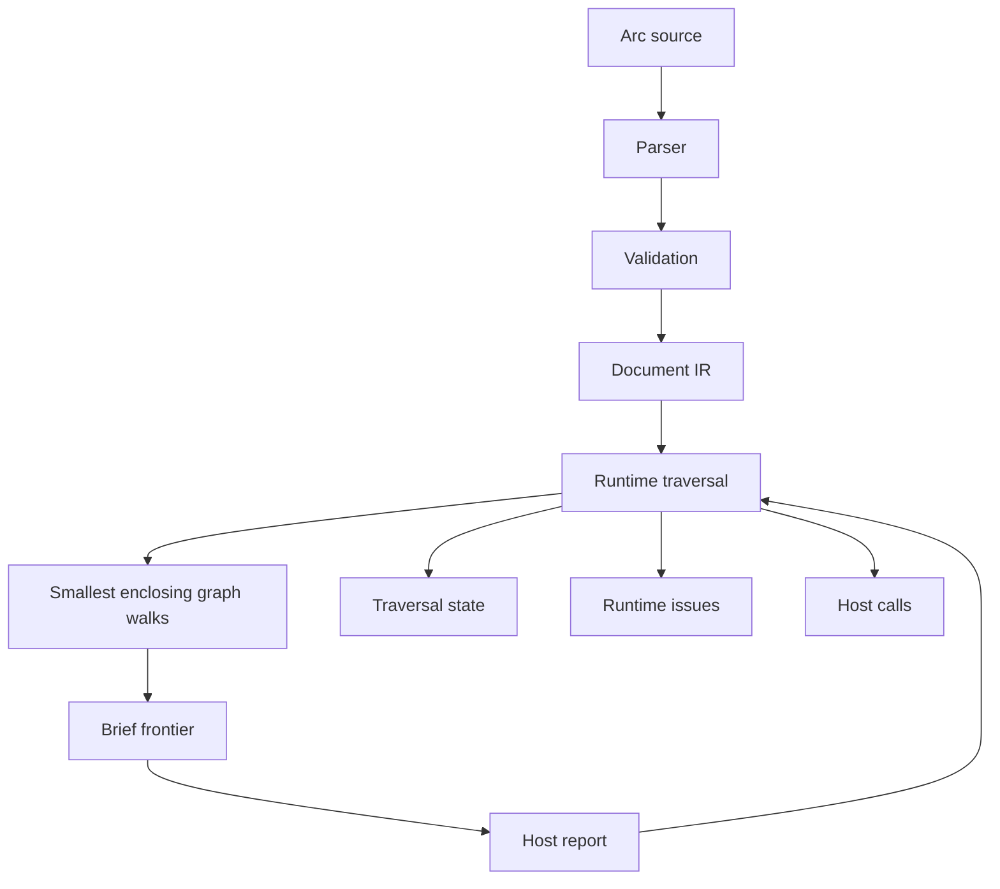

# Internal Semantics

This document normatively defines Arc parser, public IR, evaluation, traversal, persistence, and host-boundary semantics. An implementation that behaves differently does not conform to the specified semantics.


```mermaid
graph TD
  Source[Arc source] --> Parser[Parser]
  Parser --> Validation[Validation]
  Validation --> IR[Document IR]
  IR --> Runtime[Runtime traversal]
  Runtime --> SEG[Smallest enclosing graph walks]
  SEG --> Brief[Brief frontier]
  Brief --> Host[Host report]
  Host --> Runtime
  Runtime --> State[Traversal state]
  Runtime --> Issues[Runtime issues]
  Runtime --> Calls[Host calls]
```

## Parser Behavior

Parser acceptance is defined by Arc language semantics rather than by the runtime's internal structure.

Parsing recognizes Arc source and constructs Arc IR. Parse-time `Error`s are appropriate when source cannot be represented as Arc IR at all: unsupported forms, invalid hook shapes, malformed call syntax, unsupported option object shapes, non-template semantic text, or other syntax-shape violations.

Validation checks semantic references and cross-IR constraints after IR exists. `ValidationIssue` is appropriate for unknown cells, unknown nodes, duplicate labels, illegal channel references, invalid template interpolation contents, and other constraints that can be checked on normalized IR.

`Dialog.user` and `Dialog.self`, along with their `user` and `self` shorthands, lower to the same semantic `ref` parts. The distinction is authored syntax only and does not survive in IR.

`parse(source)` is allowed to throw the first validation issue as an `Error` for convenience, but `validate(document)` is the structured interface for validation results.

Public `Document` IR is a trust boundary. `validate(document)` covers every semantic invariant needed to run a hand-crafted or deserialized document safely, including target binding, scoped expression legality, and duplicate bindings. Expression-bearing fields are structurally validated before typed walkers consume them; a public `ValueString`, for example, must have an array of string-valued text parts or recursively valid value-expression parts, and cannot contain semantic-only parts. The parser may reject the same rule earlier when source cannot be represented as valid IR or when the source form has a more specific diagnostic.

The public graph itself must consist of plain enumerable data properties and dense ordinary arrays. Accessors, symbol or non-enumerable fields, custom prototypes, array properties, holes, cycles, and unsupported JavaScript values produce `INVALID_PUBLIC_IR`. This shape check runs before semantic walks and does not invoke caller-defined accessors.

## Parser Semantics

Shared authored forms should have one coherent interpretation. Equivalent syntax must not drift into incompatible semantics just because it appears in a different construct.

Target expressions are one example. `$enter(Target)`, `$enterLoop(Target)`, and `this.deflection.escaped(Target)` may allow different target shapes, but a bare target should mean the same structural reference in each place: a local child node or local import binding resolved by Arc reference-name rules.

Scoped reserved names are acceptable when they are local to a coherent authored construct. `args` and `returns` are local channel namespaces inside node bodies. `span` is a local namespace inside a `$map` callback, carrying that member's `item`, `index`, and `result`. Global namespaces such as `State` and `Dialog` are document-wide.

Scoped language forms should be available only in their intended authored scope. Outside that scope they should fail clearly rather than silently becoming ordinary cells or unrelated expressions.

Host-module aliases cannot use any Arc-reserved identifier: primitive and global roots, semantic identifiers, action roots, target wrappers, or the scoped `args`, `returns`, and `span` namespaces. Source parsing rejects the alias while collecting imports. Public `Document` validation performs the same check before expression validation, so a reserved alias cannot change how an expression-shaped object is interpreted.

Static coherence derives evidence from the value producer and applies the consumer-specific judgment defined by the Spec System. Writes, operation operands, and reusable channel bindings deliberately ask different questions of the same producer.

## Spec System

Arc values and Arc specs have different roles. An expression produces a carrier value: a primitive, array, Artifact carrier, dialog cursor, host payload, or unset result. A spec is a read/write guarantee attached to a stable site. `CellSpec` guarantees what may land in and later be read from a cell; `ChannelSpec` does the same for a channel; array specs recursively guarantee their elements. A one-level array element guarantee may be scalar or Artifact, while only scalar-element arrays are observable. Enum membership, finite `Num`, non-negative-safe-integer `Index`, Artifact, and cursor guarantees are stronger than their JavaScript carrier types.

TypeScript spec and value-carrier types are representational supersets. Membership in `CellSpec`, `ChannelSpec`, `CellValue`, or `PayloadValue` proves only that a JavaScript shape is representable. Arc validates semantic spec invariants and applies a consumer's concrete admission before the value is used or stored. Observation configuration such as `observing` and `observeAs`, and an Artifact cell initializer, belong to authored cell declarations; they are not fields of the read/write guarantee.

An arbitrary expression has no required spec. For example, `0 / 0` is a valid arithmetic expression that produces the numeric carrier `NaN`. Arithmetic accepts that flying value, and `Num.isFinite(0 / 0)` returns `false`. A `Num` cell promises finite reads, so the same value cannot land there.

Static coherence derives producer evidence on demand from the original IR and its lexical context:

- a cell or channel read supplies that site's spec;
- an array-element read and `span.item` supply the selected element site's spec;
- `span.index` and array length supply intrinsic `Index` provenance;
- a literal supplies its exact value;
- an array literal supplies its element evidence, while an empty array is contextual;
- boolean, string, and numeric operations supply their result carrier fact;
- Artifact construction and dialog-cursor production supply their intrinsic provenance;
- a conditional expression retains both branch alternatives for its consumer;
- a structured host argument supplies Struct provenance;
- a host call resolved through an injected operation declaration supplies that operation's result spec as site evidence; an environment-free or otherwise untyped host call supplies no source fact.

Producer evidence is recomputed from the IR when a consumer needs it. It is not carried beside a value, encoded in a value tag, or persisted in a pin. This is especially important for `{ path: "x" }`: Artifact provenance selects Artifact validation and projection, while structured-argument provenance treats the identical carrier as a Struct. Object shape alone never selects Artifact semantics.

Arc applies three distinct spec judgments as a document moves from analysis through registry initialization to execution:

1. **One-time landing coherence** is used during document analysis for a particular expression-to-destination occurrence, such as a cell or return write. It checks producer evidence against the destination spec and returns `compatible`, `incompatible`, or `unknown`. `unknown` means only that this invocation cannot prove either conclusion; analysis rejects `incompatible` and leaves `unknown` for concrete admission when the expression executes.
2. **Reusable compatibility** is used for channel bindings. Document analysis applies it when both endpoints are available in the same document; `Runtime.init()` applies the same relation after resolving imported Arc targets against the complete registry. It succeeds only when every value guaranteed by the provider site is acceptable to the receiver site, because the binding may carry many future values.
3. **Concrete admission** is the final runtime check when an actual value reaches a `CellSpec` or `ChannelSpec`. It enforces Bool, Str, Enum membership, finite `Num`, `Index` bounds, recursive arrays, Artifact, and cursor invariants before the value is used or stored. Analysis may apply the same predicate early when it has an exact literal, but every constrained runtime landing still admits its concrete value.

Injected host-module specs participate at those same stages. A declared host parameter is the destination of one authored argument operand: analysis judges that occurrence from its `HostCallArgument` IR and runtime evaluation admits the rendered value immediately before emitting the call. A declared host-call result is producer evidence only when a surrounding consumer demands a value. When the host reports an expression result, transport sanitation runs first and concrete admission against the declared result runs before the value can hydrate a pin. Artifact authority therefore comes from the resolved result spec rather than the payload's object shape. Action consumers demand no value and perform no result admission.

Environment-free document analysis has no host-operation resolver, so host calls remain dynamic there. `Runtime.add()` repeats analysis on its private document under the runtime's immutable host-module registry and is definitive for module paths, arity, parameter operands, declared results, and result consumers. `Runtime.init()` retains the separate reusable-compatibility pass that requires the complete Arc document registry.

The core directional relations are:

| Producer evidence | Destination | One-time result | Reusable result when both are sites |
| --- | --- | --- | --- |
| `Index` | `Num` | compatible | compatible |
| `Num` | `Index` | unknown | incompatible |
| `Enum(A)` | `Str` | compatible | compatible |
| `Str` | `Enum(A)` | unknown | incompatible |
| `Enum(A)` | `Enum(B)` | compatible when A is a subset of B; unknown when they overlap; incompatible when disjoint | compatible only when A is a subset of B |
| matching Bool, Artifact, or cursor | same family | compatible | compatible |
| exact literal | any destination | result of concrete admission | not applicable |
| boolean carrier | Bool | compatible | not applicable |
| string carrier | Str / Enum | compatible / unknown | not applicable |
| numeric carrier | Num or Index | unknown | not applicable |
| array evidence | array destination | recurse over elements | recurse over element site specs |
| empty-array evidence | array destination | compatible | not applicable |
| no source fact | any destination | unknown | not applicable |

Different proven families are incompatible. Array evidence is incompatible with a non-array destination. A one-time write may defer `unknown` to concrete destination admission; a reusable binding rejects anything it cannot prove.

A conditional expression `cond ? x : y` is a special producer because it does not receive one merged spec. Analysis retains both `x` and `y` and asks the eventual consumer to judge each one. Their judgments use one deterministic reducer at every landing: if any reachable branch is `incompatible`, the conditional is rejected; otherwise, if at least one branch is `unknown`, the conditional is deferred; only all-`compatible` branches are accepted. A dynamic branch contributes the one-time result obtained from absence of a source fact. At runtime, only the selected branch is evaluated, and its concrete result is admitted by the consumer before use or storage.

Operation rules refine these general relations. Parser analysis supplies producer context and applies the rule's static projection; evaluation obtains concrete operands and applies the same rule's strict projection immediately before operating. Arithmetic and `Num.isFinite` require numeric carriers but allow non-finite intermediates. Numeric comparison requires finite numbers. Enum ordering requires one unambiguous proven Enum domain: a member literal or dynamic operand may be checked against that domain, a known `Str` site is rejected, and conflicting proven Enum domains are rejected. Enum equality instead uses ordinary string equality without declaration or membership constraints. Without an Enum domain, admitted strings use ordinary string ordering. Array equality preserves one shared element authority from its producers: a scalar comparison family or Artifact. It rejects conflicting proven families, recursively admits every concrete element under the selected authority, and then compares structure in order. A pair of dynamic object arrays cannot acquire Artifact authority from carrier shape. Artifact projection requires proven Artifact production or an explicit Artifact landing authority.

Every constrained runtime landing performs concrete admission even when static evidence was compatible. This includes cell and array-element writes, staged returns, direct root arguments, observation results, restored by-value channels, interpolation, comparison, host-bound emission, and persisted state restoration. Observation admission first enforces the cell guarantee and then applies observation-only `observeAs` constraints.

A value pin proves only that its producer completed with a durable carrier. When an enclosing operation resumes, it replays the carrier, derives evidence again from the original producer IR and current host-module registry, reapplies the enclosing operand admission, and only then operates. A completed outer expression proceeds synchronously into its destination admission; there is no resumable gap between expression completion and storage. Traversal state and pins persist no host spec or producer evidence.

Unset is absence of a value, independent of spec resolution. Setness expressions inspect absence directly. Each consumer that requires a concrete value owns its unset result or diagnostic.

Static analysis checks every readable value cell, including non-observable cells, for reads before it is definitely set. Shadowed declarations are tracked independently, and a declaration with an initializer becomes set only after that initializer completes in source order. Writing an array element requires the root array to already be set, so `items[i].$set(value)` reads `items` and cannot set an unset root array.

## Numeric Source / IR Semantics

Numeric source declarations normalize to one canonical Source / IR representation:

```ts
type NumericObserveAs =
  | { kind: "number"; min?: number; max?: number }
  | { kind: "integer"; min?: number; max?: number };

type NumericObservableSpec = {
  type: "number";
  observing?: SemanticString;
  observeAs?: NumericObserveAs;
};
```

Numeric cell specs and numeric array-element specs use `type: "number"`. Numeric channel specs use `{ type: "number" }` without `observeAs`. Canonical Source / IR has no `type: "rangedInt"`; the parser lowers authored `RangedInt(min, max, config?)` immediately to a numeric observable spec with integer `observeAs`.

`NumericObserveAs` belongs to Source / IR only. Observation briefs represent `{ kind: "number", min?, max? }` as flat `{ type: "number", min?, max? }` metadata. They represent `{ kind: "integer", min?, max? }` as flat `{ type: "rangedInt", min, max }` metadata, filling omitted bounds with JavaScript's safe-integer extrema. Observation briefs and reports never expose `observeAs`.

Arithmetic IR keeps comparison, logical, and arithmetic operator families distinct:

```ts
type ArithmeticExpression<TExpression> = {
  kind: "arithmetic";
  op: "+" | "-" | "*" | "/" | "%";
  left: TExpression;
  right: TExpression;
};

type NumericUnaryExpression<TExpression> = {
  kind: "numericUnary";
  op: "-";
  argument: TExpression;
};

type NumIsFiniteExpression = {
  kind: "numIsFinite";
  argument: ValueExpression;
};
```

`ValueExpression` instantiates arithmetic operands with `ValueExpression`, so general arithmetic may suspend. `LocalExpression` instantiates the same arithmetic forms with `LocalExpression`, so array indices and `CellTarget` accessors admit brief-free arithmetic without admitting host calls, judgments, comparisons, logical expressions, `numIsFinite`, templates, conditionals, or array literals. `NumIsFiniteExpression` is general-value-only. Validation walks every expression in its owning `value` or `local` mode and rejects a cross-stratum subtree with `INVALID_EXPRESSION_STRATUM`.

Valid public IR contains only finite numeric literals and canonical numeric specs, and it satisfies the exact `observeAs` shape and placement, operator-family, `numIsFinite`, `Dialog.lastTurns`, and expression-stratum rules. `validate(document)` checks these rules without mutating `document`. `Runtime.add(...)` applies the same validity contract while collecting an independent private copy of all roots atomically. A non-finite number is rejected as such rather than accepted as another value, and accepted negative zero is represented as zero in collected IR.

Before contextual source-shape checks, `parse(source)` rejects any program containing a non-finite numeric literal. This covers ordinary expressions, host params and nested host-param values, and `Dialog.lastTurns(...)`. The rejection is an ordinary `Error` with own enumerable `code: "NON_FINITE_NUMBER"` and `loc: SourceRange`, exact `message: "Numeric literal must be finite"`, and no `reasonCode`. Signed host-parameter syntax remains unsupported, and `Dialog.lastTurns(n)` retains its direct non-negative-safe-integer-literal grammar; `NON_FINITE_NUMBER` takes precedence when a signed literal is non-finite.

Numeric public-IR validation has these stable issue codes and messages:

| Code | Message contract |
| --- | --- |
| `NON_FINITE_NUMBER` | `Document contains a non-finite number at <IR-path>` |
| `NON_CANONICAL_NUMERIC_SPEC` | `Source / IR numeric spec at <IR-path> must use type "number"; found "rangedInt"` |
| `INVALID_NUMERIC_OBSERVE_AS` | `Invalid numeric observeAs at <IR-path>: <detail>` |
| `INVALID_COMPARISON_OPERATOR` | `Invalid comparison operator <JSON-string> at <IR-path>` |
| `INVALID_ARITHMETIC_OPERATOR` | `Invalid arithmetic operator <JSON-string> at <IR-path>` |
| `INVALID_LOGICAL_OPERATOR` | `Invalid logical operator <JSON-string> at <IR-path>` |
| `INVALID_NUMERIC_UNARY_OPERATOR` | `Invalid numeric unary operator <JSON-string> at <IR-path>` |
| `INVALID_LOGICAL_UNARY_OPERATOR` | `Invalid logical unary operator <JSON-string> at <IR-path>` |
| `INVALID_NUM_IS_FINITE_EXPRESSION` | `Invalid Num.isFinite expression at <IR-path>: expected one value-expression argument` |
| `INVALID_DIALOG_LAST_TURNS_COUNT` | `Dialog.lastTurns count at <IR-path> must be a non-negative safe integer` |
| `INVALID_EXPRESSION_STRATUM` | `Expression at <IR-path> is not valid in the <local\|value> expression stratum` |
| `NON_NUMERIC_ARITHMETIC_OPERAND` | `Arithmetic operator <op> requires a numeric <left\|right\|argument> operand` |
| `NON_NUMERIC_IS_FINITE_ARGUMENT` | `Num.isFinite requires a numeric argument` |

The allowed `INVALID_NUMERIC_OBSERVE_AS` details are `expected an object`; `unsupported field <JSON-string>`; `kind must be "number" or "integer"`; `<min|max> must be a number`; `bounds must satisfy min <= max`; and `integer <min|max> must be a safe integer`. A non-finite bound instead produces `NON_FINITE_NUMBER`.

IR and payload diagnostic paths use one grammar: root `$`; numeric brackets for array indices; bracketed `JSON.stringify(key)` for every object key; no dot notation. Arrays walk in ascending index order and objects in `Object.keys` order. Thus `$["0"]` is an object key, `$[0]` an array position, and keys containing dots, brackets, quotes, backslashes, or empty text stay unambiguous.

`PayloadValue` is the recursively serializable carrier accepted across the Arc-host boundary, not a complete expression of an authored cell's constraints. Its structs admit ordinary string keys, including `$`-prefixed keys. Only top-level `undefined` represents an omitted payload; nested values must be set, arrays must be dense data arrays without extra properties, and structs must expose enumerable data properties on a plain or null prototype. `null` is rejected at every payload boundary. Cell and channel specs apply their additional constraints at the typed boundary.

An Artifact runtime value has the exact shape `{ path: string }`, with path validity enforced by `createArtifactValue` and Artifact-typed admission. That shape is not globally self-identifying: in an unconstrained payload it is an ordinary struct. Artifact meaning comes from an `ArtifactConstructExpression`, an Artifact cell or channel spec, or another expression context whose Artifact family is statically known.

## Numeric Evaluation and Admission

All numeric values are JavaScript `number`s. Arithmetic evaluation may temporarily produce any IEEE-754 number, including `NaN`, infinities, and negative zero.

Arithmetic applies `+`, `-`, `*`, `/`, `%`, and numeric unary `-` with JavaScript numeric semantics and no coercion, truncation, rational wrapper, zero-divisor special case, or immediate finite-result check. Recursive evaluation is left operand then right operand. A non-number is rejected by the settled static or dynamic arithmetic diagnostic; an unset numeric cell fails earlier with `unset-value`.

`Num.isFinite(argument)` evaluates its argument normally, requires a number, and returns `Number.isFinite(argument)`. It catches no evaluation error, performs no coercion, and creates no refinement, cached-result relation, or authorization for a later evaluation. Its completed boolean follows ordinary pin behavior.

When an arithmetic, numeric-unary, or `Num.isFinite` rule judges a producer, it derives evidence exhaustively over `ValueExpression`:

- Numeric literals; numeric cells, channels, and elements; `array.length`; `span.index`; `this.enterCount`; dialog turn differences; and validated arithmetic/numeric-unary expressions are numeric.
- String, boolean, enum, state, and `null` literals; value templates and string scopes; whole arrays and array literals; comparisons and other boolean expressions; cursors; and node or pending states are known nonnumeric.
- A declared `span.item` or array-element read follows its element spec.
- A conditional judges both retained alternatives: an incompatible branch rejects, otherwise a branch without numeric proof makes this rule invocation `unknown`.
- An environment-free host call supplies no source fact, so that numeric-rule invocation is `unknown` and defers to concrete operand admission. Under a definitive host environment, the declared result spec determines whether the call is numeric, incompatible, or still refinement-dependent.

This evidence resolution is exhaustive. Artifact producers are incompatible with numeric operations; undeclared channels and out-of-scope `span` forms retain their owning diagnostics rather than being replaced by an arithmetic error.

A numeric comparison requires finite operands before producing a boolean. Every cell, array, array-element, span-result, and return write requires finite numbers at every nesting depth before mutation and ignores `observeAs`. Value and semantic interpolation require finite numbers before string coercion. Host-call arguments, briefs, and effects require finite numbers before emission. Accepted values represent negative zero as zero at every nesting depth. Array indices instead use their specific non-negative-safe-integer and range diagnostics.

Dynamic nonnumeric arithmetic reports `Arithmetic operator <op> requires a numeric <left|right|argument> operand; got <runtime-kind>`. Dynamic nonnumeric `Num.isFinite` reports `Num.isFinite requires a numeric argument; got <runtime-kind>`. Stable runtime-kind labels are `string`, `boolean`, `null`, `array`, `object`, and `node-state`; unset remains `unset-value`.

A failed finite-value check reports `Numeric value must be finite before <consumer><path-suffix>`. Stable consumer labels correspond to the comparison, write, interpolation, and emission sites above. A nested failure appends ` at <payload-path>`. Index consumers retain their index-specific reasons. Division and remainder by zero have no dedicated diagnostic because the arithmetic result remains an internal value until one of these sites or `Num.isFinite` uses it.

`Index()` is a non-negative-safe-integer refinement of `Num()`. Assignability is directional: `Index` provides a valid `Num`, while an arbitrary `Num` cannot provide an `Index`. Return writes, array reads, and every decorated-target accessor enforce the refinement on the resolved value.

## Template Evaluation

Templates process their authored parts from left to right. Literal-text parts contribute immediately, and each expression part evaluates at its authored position. `ValueString` propagates a blocked expression without evaluating later parts; after resume, the expression pin tape preserves already completed work. Valid `SemanticString` expressions contain no briefable expression, so their evaluated parts complete in the same source order.

Both forms report `invalid-template-interpolation` when interpolating an unset value. Numeric values must satisfy the form's finite-number consumer before conversion, including numbers nested in an interpolated array. Admission depends on the evaluated runtime value rather than source syntax, so a host-call result follows the same rules after resumption.

| Interpolated part or value | `ValueString` result | `SemanticString` result |
| --- | --- | --- |
| Literal text | Appended as authored. | Appended as authored; adjacent text parts coalesce. |
| String, boolean, or finite number | Appended with `String(value)`. | Appended with `String(value)`. |
| Array of primitive values | Appended through JavaScript array stringification: comma-joined, with an empty array contributing empty text. | Appended through the same array stringification. |
| Array with Artifact element authority | Rejected with `invalid-template-interpolation`. Indexing first projects the selected Artifact path. | Rejected with `invalid-template-interpolation`. Indexing first emits the selected structured Artifact part. |
| Expression known to have the Artifact family | Its value's logical `path` is appended as text. | A structured `{ kind: "artifact", path }` part is emitted. |
| Entity reference | Not admitted in a value-position template. | A structured `{ kind: "entity", name }` part is emitted. |
| Host-variable reference | Not admitted in a value-position template. | A structured `{ kind: "hostVar", module, path }` part is emitted. |
| `null` or another object-shaped value | Rejected with `invalid-template-interpolation`. | `null` contributes empty text; another value follows ordinary `String(value)` conversion. |

A completed `ValueString` is always an ordinary string. A completed `SemanticString` is a plain string when every contribution is text; if any entity, host-variable, or Artifact part is present, it is a `SemanticTextPart[]` with the structured parts preserved.

## Element Ids

Every statement and every briefable expression carries one identity, the element id, and it is structural: the element's position within its SEG scope, prefixed by the scope's owner chain. No allocator exists — ids are derivable from document shape alone. A scope is a SEG: the node-lifecycle scopes (`body`, `guard`, `effects`, `trigger`, `catch`, and the node-level `deflectWhen` declaration), an owned hook scope (`<ownerId>/resolveWhen`, `<ownerId>/deflectWhen`), or an invoke body or `$map` callback (the invoke's or the `$map` statement's own id is the scope). Within a scope, a step is a sibling index with a branch tag (`c` consequent, `a` alternate, `l` label body) on every non-terminal step, and briefable expressions inside one statement take the statement's id plus `~n` in evaluation order. Examples: `body/0c/1`, `guard/0`, `body/2/0` (first statement of the invoke at `body/2`), `body/3/resolveWhen/0`, `body/0~0`.

The branch-tag invariant makes ids injective: an untagged step always ends its scope's local path, so whatever follows unambiguously opens a nested scope. Ids are node-relative — every node has a `body/0` — and anything crossing nodes pairs the id with a node ref (brief ids, enter continuations, anonymous-copy refs). The alphabet excludes `.` `:` `[` `]` `#`, so an id embeds safely in refs and brief ids. Consumers never parse ids; the single sanctioned manipulation is the inherited-hook brief-site prefix substitution described under Runtime State Invariants.

Scoping is what makes ids stable: editing one SEG never shifts another SEG's ids, so an added effects hook leaves every body id — and every brief id and persisted record key built from them — unchanged. The accepted residue is local: an edit earlier in the same branch shifts the ids of later siblings (and, transitively, scopes nested under them), and an edit to a statement's expressions renumbers that statement's `~n` suffixes. Both stay confined to the edited region.

`stampElementIds(node)` is the canonical stamper: it derives every id from shape, writes it in place, and rebuilds `newcopyAliases` (which embed enter-statement ids). Stamping is idempotent. `parse(...)` stamps its own output; `Runtime.add(...)` stamps its private clone, so hand-built IR registers without a manual step; `validate(...)` / `analyzeDocument(...)` only verify — a non-canonical or unstamped id is a validation issue, never a silent repair, and the input is never mutated. An inherited `deflectWhen` is stamped under the static `deflectWhen/` scope, never the owning instruction's: re-stamping a genuinely shared hook array rewrites the same ids, and stamping a clone-severed private copy is what makes it canonical.

## Runtime Error Handling

Runtime APIs distinguish caller misuse from authored execution failure.

Caller/API misuse throws. Examples include duplicate document registration, unknown arc references passed to `newTraversal(...)`, unknown brief object identity passed to `progress(...)`, and invalid root traversal phase passed to `start(...)`.

Host report protocol problems do not throw once a known brief is supplied. Illegal moves, unknown brief ids, invalid judgment values, and invalid observation payloads are surfaced as `RuntimeIssue` entries on the next brief. A rejected report replans from the previous accepted snapshot.

Authored execution failures are caught at runtime advancement boundaries and converted to `RuntimeIssue { kind: "poisoned-traversal" }`. A known throw site supplies a stable cause-specific `reasonCode`; an uncategorized exception uses `other-runtime-error`. In action progression, the active root traversal becomes `phase: "poisoned"`. In trigger probing, the poisoned candidate is recorded and probing continues for other arcs.

The runtime describes every host operation with a `HostCallBrief`; executing the handler and delivering its result are host-owned. If the host cannot accept that frontier, for example because no implementation exists for the referenced module, it may report `move: "poison"`. Otherwise it reports the call's brief id with `{ status: "resolved", value? }`. Expression consumers use and validate the value; action consumers resolve without demanding one.

## SEG Semantics

A smallest enclosing graph, or SEG, is the smallest local statement graph that owns a structural walk, resolved-once action state, and a pin tape. Node bodies, lifecycle and action hooks, effects, triggers, invoke bodies, and map-member callbacks are separate SEGs.

### Walk state

A SEG walks its statements through an explicit frame stack. `if`, `label`, and `break` shape that stack; leaf statements act at the current position. When an action resolves, the walk advances to the following statement. Decisions and evaluations already crossed remain pinned, while later evaluations observe updated state and append to the same tape.

Each resolved-once action occurrence has one frame slot: absent before reach, pending while blocked at the frontier, and resolved after settlement. Authored `$` forms such as `$enter(...)`, `$observe(...)`, `cell.$set(...)`, and `Memoir.facts.$apply(...)` use these slots and resolve once per logical action instance. For a host call, the pending slot stores its rendered arguments and `hostParams`; retries re-emit that capture under the same id without reevaluation. A grouped `$observe({ ... })` is one slot and writes all `resolved` fields atomically before advancing; an invalid or incomplete report writes nothing and re-emits the group.

Expressions have no resolved-once slot. Every non-constant sigil-less evaluation — including judgments, host calls, `Dialog.*`, cell/channel/outcome reads, and invocation completions — reserves its position on the SEG's pin tape when first reached. The tape is keyed by statement element id and evaluation order, so resume can replay the exact route without re-reading state that may have changed while frontier work settled. Accepted judgment and host-call results fill their pending tape entries. Action-traversal tapes persist with traversal state and therefore survive runtime reconstruction.

A completed expression value is pin-admissible only when every nested number is finite. An admissible scalar, array, or object is pinned with negative zero recursively represented as zero. A non-admissible value remains available to its immediately enclosing evaluation but is not recorded; its tape position remains unresolved. Already completed admissible child pins remain, so replay recomputes the unrecorded parent without duplicating settled host work. This applies to arithmetic, array literals, conditionals, and every other compound expression.

Cell-writing and observation actions carry a `CellTarget`: one lexical root name followed by local-expression accessors into its inner value. The runtime resolves those accessors before evaluating a `$set(...)` value or emitting/consuming an observation. Local arithmetic remains brief-free, and non-constant accessors therefore pin on the same statement tape, fixing a dynamic target such as `items[index + 1]` across suspension and process reconstruction. Every accessor must be a non-negative safe integer before array bounds are checked. An array-element write validates the selected `ArrayElementSpec`, deep-clones the admitted replacement and complete root array, preserves its siblings, and commits one root-cell write before the SEG advances.

### Suspension and resume

A SEG suspends when its walk reaches unresolved frontier work that requires host coordination and yields a brief. Applying a report resumes the action at that boundary: a valid report settles the pending work, while a report that does not settle it leaves the same frontier suspended and yields its brief again.

At suspension, the runtime records the deepest blocked SEG as the action root's active frame: the active traversal and the SEG containing the frontier. To resume, it **seeks** that frontier instead of re-deriving the arc from its root. It walks the recorded SEG from its top with its existing state honored: pinned expressions replay, resolved `$` slots skip, and only unanswered frontier work re-emits.

Resume starts at the deepest suspended work and unwinds outward only as each owner finishes. A frontier inside a child resumes inside that child; when the child finishes, control returns through the `$enter(...)` continuation that owns it. A frontier inside an `$instruct(...)` or `$enterLoop(...)` hook resumes at that owner action and carries it out before the enclosing body continues. If any level blocks again, its enclosing SEG remains suspended.

Values bind when their evaluation is first reached. A later brief may therefore continue with earlier `Dialog`, host-variable, or cell-derived values still pinned while newly reached evaluations bind against current inputs. Dialog advancement alone does not revisit an earlier branch.

### Boundaries

A fresh SEG instance starts with empty resolved-once state and an empty tape. Fresh instances include a `forgetful` / `newcopy` entry, a new hook consultation, a new invoke, and a new map member. A host-call action reached in a fresh instance executes again, while a retry of a pending instance preserves its captured inputs and brief id. Explicit restart boundaries are separate from ordinary write continuation: a caught deflection restarts the catching node body and drops that body tape.

Trigger evaluation uses the same pin-and-seek model per candidate consultation. Retries on one trigger brief chain retain answered pins and re-emit only blocked work. A fresh `startTrigger(...)` starts fresh consultations, while terminal candidate outcomes remain stable within a retry chain. A terminal match can therefore coexist with work from open candidates. Without an effective `preferredMatch`, implicit sole-match selection waits until no consultation work remains. An explicit preference for a terminal match selects immediately and discards the other candidates' pending work from the matched brief; a preference for an open candidate remains pending until it either matches or settles unmatched. An unmatched request is rejected rather than falling back to another match or reporting ambiguity. Trigger consultation state lives in the in-memory brief chain rather than persisted traversal state, so process reconstruction begins fresh consultations.

The runtime retains batch-shaped instruction collection and resume machinery, but the current compatibility gate declines every attempt to add a second instruction to the batch. The walk therefore blocks at the first exposed instruction. This is an implementation scheduling choice, not a protocol cardinality guarantee: hosts still consume the full `ActionBrief.instructions` array and report by brief id.

A pending instruction persists its current host-facing phase (`apply` or `postcheck`) in its action state. Planning walks only reconstruct that frontier; they never acknowledge it or derive a terminal instruction outcome. An accepted action report contributes an apply-walk-local application fact only for each `instructions[id].status === "applied"` entry; `move: "proceed"` contributes none by itself. The owner evaluates reported `deflectWhen` / `resolveWhen` probes independently of that fact, so a check may deflect before application and checks and application may settle together. When a report contains multiple instruction items, each application and postcheck result remains independently keyed. A non-terminal unconfirmed instruction stays in `apply`; a confirmed instruction blocked on checks stays in `postcheck`. Rejected reports contribute no application facts. A lap — one `$instruct` pendency or one `$instructLoop` iteration — collects two evidences, each banked on the action state once settled: the deflect evidence (`deflectWhen`) and the finished evidence (application for `$instruct`, `resolveWhen` for `$instructLoop`). Banked evidence survives fresh runtimes, and a banked hook poses no further checks, so later briefs carry only the open evidence's checks. A true deflect evidence short-circuits the lap at that handback, honoring the finished evidence collected so far: a finished lap stays resolved through the deflection, an unfinished one re-presents fresh after a catch or re-entry. With both evidences in and no deflection, a finished-true lap resolves the action and a finished-false loop lap starts a fresh lap with no banked evidence.

Transition gates use the same active-frame suspension machinery. Genuine traversal entries and exits accumulate in a latch that flushes at the first authored evaluation. Entry gates record the evaluation site; exit gates record the terminal child while reporting the caller as the new position. Resume then replays the same gated hop under the acknowledging dialog.

### Experimental rewalk

A `Node` IR may set `writeDiffMode: "rewalk"` so a changed write diff restarts the current SEG and releases its sigil-less tape. This is experimental and not enabled by default; `parseNode()` sets `"advance"`. Its restart loop is bounded and poisons a non-convergent traversal.

## Arrow Invocation

`invoke(() => { ... })` is a first-class statement with an attached statement graph — the body — run inline in the enclosing node. The body shares the enclosing node's cell scope and enters no traversal of its own; its statements' element ids live under the invocation's own scope (the invoke's id is their prefix), so statement addressing (hook owners, enter continuations) stays unique node-wide while edits inside the body shift no ids outside it. The statement-position IIFE form is a parse error pointing at `invoke`, and `invoke` is a reserved name for cells and nodes.

The body admits the full node-body action-graph dialect — `$enter` / `$enterLoop` / `$instruct` / `$instructLoop` / nested `invoke` in addition to `cell.$set` / `$observe` / `$observeOrAsk` / expression-position `judge` / `if` / `label` / `break`, with an independent label scope. Rejected at parse time: a missing or extra argument, `return`, parameters, the `function`-expression form, and `let` / `this.*` / `function` declarations inside the body. In-body instructions inherit the enclosing node's default deflection: the effective `deflectWhen` is threaded into the body parse as their `defaultDeflectWhen`.

An `invoke` is never memoized, and its lifetimes follow the frontier model directly:

- **The completion is a sigil-less pin.** When the body completes, the completion pins on the enclosing SEG's tape under the invocation's element id: a resume replays it and skips the statement whole, while an explicit restart of the enclosing SEG releases it and lets a fresh reach run the body again. No invocation-specific resume flag exists.
- **A fresh reach is a fresh invocation.** The body is its own SEG instance per invocation: on a fresh reach, the previous invocation's `$` slots, hook scopes, and body pins all clear, so `$enter` / `$observe` / `$instruct` inside the body resolve once per invocation. Within one invocation they stay resolved across suspensions.
- **A blocked invocation resumes itself.** The block records the invocation SEG (`{ kind: "invoke", owner }`); resume routes the node body AT the outermost enclosing invocation, and the invocation's body seeks from its top against its own tape — earlier body work replays from pins. An owner recorded inside an `invoke` body (a hook of an in-body instruction, a nested `invoke`) routes the same way.
- **The enclosing SEG continues after the invocation.** Writes performed by the body are visible to later statements while earlier evaluations remain pinned.
- **The body evaluates under the enclosing node's view.** An `invoke` enters no traversal, so it latches no transition and never rotates the view; briefs from inside the body carry the enclosing node's ref as source and active ref.

Deflection boundaries: a deflection raised in the body — including a host `move: "deflect"` on a frontier blocked inside it — abandons the open invocation (the outermost open invocation's slot and subtree clear) and routes to the enclosing node's own catch; `escaped(Target)` matches the authored child target through the body. A child entered from the body that catches its own deflection resolves internally and leaves the invocation open. An uncaught child deflection abandons the invocation as it crosses the child's `enteredBy` into the body. In every abandoning case, the catch restart reaches a fresh invocation.

## Map Members

`arr.$map(callback, results?)` is a `$` resolved-once action that runs its callback — a bare arrow attached to the `$map` statement — once per element of a pinned input array. Like an invoke body, the callback shares the enclosing node's cell scope and its element ids live under the `$map` statement's id on the invoke scheme; unlike an invoke, each element is a distinct runtime instance, the member, whose brief sites, tape, and enter copies are qualified by member index.

The pending action carries the arena: the input read once at first reach, and an index cursor over the members. Members before the cursor are terminal, holding their validated `span.result`; the member at the cursor is in-progress or not yet started; the rest are absent. The pinned input, terminal values, and staged result are deep-cloned with their members when traversal state is cloned. v1 is sequential — at most one member and one anonymous copy are live — so a terminalized member's `$` slots, tape, and copy clear before the next member runs, and the callback's node-frame slots are reused per member, exactly as a fresh invoke reach starts clean.

`span` is the member's owner-bound namespace. `span.item` and `span.index` read the current member's element value and index; a callback `$enter` captures them by value into child args at bind time. `span.result` is the member's evaluator-local output: `span.result.$set(...)` stages it directly, or an `$enter` binds it as a return sink that commits when the child covers. When `results` is bound, a member that completes without a staged `span.result` is a runtime error.

Lifetimes follow the frontier model, as an invoke's do:

- **The completion is a sigil-less pin.** When every member is terminal, the runtime constructs the output in index order, commits it to `results` in one write (absent for the forEach shape), pins the completion on the enclosing SEG's tape, and clears the arena. An explicit enclosing-SEG restart releases the pin, and the next reach re-reads the receiver.
- **A blocked member resumes itself.** The block records the member SEG (`{ kind: "mapMember", owner, index }`) or, for a briefing leaf inside it, that leaf's own hook; resume routes the node body AT the `$map` — the outermost enclosing wide-body owner — and the driver re-enters the member, whose body seeks from its top against the member tape.
- **The enclosing SEG continues after the map.** Member writes and the final `results` commit are visible to later statements. `results` may be the receiver: evaluation reads the pinned old value, and resolution performs one replacement.

Deflection boundaries: a deflection raised in a member — including a host `move: "deflect"` on a frontier blocked inside it — abandons the member and, crossing the `$map`, clears the whole arena (arena, terminal rows, pinned input), then routes to the enclosing node's own catch, reusing the wide-body crossing precedent. A caught restart reaches a virgin `$map`; an uncaught deflection deflects the node with no `results` commit. Cell mutations and host-call actions earlier members already resolved stay resolved — the atomic construction is of the output array, not of member execution.

## Traversal Finalizing

Traversal finalizing is runtime state for completing a node outcome after the node action graph can no longer make ordinary progress.

Finalizing must be persisted in traversal state whenever it blocks on a briefable action. A later runtime call must resume the same finalizing phase, not restart the node body.

Covered finalizing sequence: enter finalizing with `reason: "covered"` while node state remains unset; expose that reason as `this.pendingState` inside effects; run effects; clear finalizing; set node state to `State.COVERED`; let the parent `$enter(...)` action resolve. The target is not fully covered for caller progression until effects finish.

Deflected finalizing sequence: enter finalizing with `reason: "deflected"` and `phase: "catch"` while node state remains unset; run `this.catchDeflection`; if it returns true, clear finalizing and restart this node's SEG; otherwise switch to effects, expose the reason as `this.pendingState`, run effects, clear finalizing, set node state to `State.DEFLECTED`, and propagate deflection to the parent.

`this.catchDeflection` uses hook-local evaluator state and a hook-local pin tape, both keyed by the persisted `origin` and `from` references in `TraversalFinalizing.deflection`. Hook-local `$observe(...)`, `$observeOrAsk(...)`, and `cell.$set(...)` leaves advance after they resolve; expression-position `judge(...)` blocks through the same catch phase, and its answer pins for the rest of the consultation. The consultation's evaluator state and tape are released together when the hook completes.

Effects are part of finalization. They may block and resume through normal brief/report progression. `this.pendingState` is derived from the persisted finalizing reason rather than stored independently, so it remains stable across effects suspension and runtime reconstruction.

## Deflection Propagation

Deflection originates at the active node or instruction frontier. Its `origin` remains unchanged while propagation rewrites `from` at each parent boundary to the canonical target of that parent's entry the deflection came up through. At the origin node itself, `from` is unset — nothing was entered.

A node's `this.catchDeflection` catches only that node's own deflection. It does not erase the triggering child's deflected state.

If a child deflects and the parent does not catch, the parent becomes deflected after its own catch opportunity fails. This propagation repeats upward until some ancestor catches or the root becomes deflected.

If an ancestor catches, that ancestor becomes the active traversal and restarts its own SEG. Already persisted child outcomes remain visible unless the action graph explicitly changes state through normal Arc operations.

The persisted pending-deflection context stores `origin` and an optional `from` as node references. `origin` identifies where deflection began and remains unchanged while it bubbles. `from` is the canonical target of the entry the deflection propagated up through, rewritten at each parent boundary and unset at the origin node. A `newcopy` entry canonicalizes back to the node/arc the author named, so `from` reflects the authored `$enter` target rather than the anonymous copy's own ref. `this.deflection.escaped(Target)` compares `from` against a bare node/import target while the node is running `this.catchDeflection` or deflected `this.effects`. It does not accept `newcopy(Target)` or `forgetful(Target)` as the argument.

## Brief And Report Invariants

Brief objects are ephemeral capability objects. The host must pass the exact brief object instance back to `progressTrigger(...)` or `progress(...)`; cloned or reconstructed objects are invalid.

The traversal set included in each brief is the persistence boundary. Hosts should persist traversal state after each brief is issued, including briefs that contain host calls or runtime issues.

Reports are interpreted against the originating brief snapshot. Unknown ids are protocol issues, not dynamic lookups into the current traversal.

An accepted host-call `PayloadValue` contains only finite numbers, with negative zero represented as zero at every nesting depth, and satisfies the recursive payload-shape rules above. The first invalid number or non-durable nested value rejects that report item; arrays are examined in ascending index order and objects in `Object.keys` order so its diagnostic path is deterministic. Observation results satisfy the same numeric representation together with their scalar, array, element, or grouped observation constraints; a grouped result is accepted only when every field is valid. Report acceptance does not mutate the caller's report object, and later caller mutation cannot change an accepted value.

`allowedMoves` is authoritative. A host may only report moves listed on the brief. The runtime validates this before applying report data.

Host-call briefs are carried in `hostCalls`, and reports address them by brief id. Expression consumers retain the result through their pin tape. Action consumers use resolved-once state: the runtime captures the invocation, suspends at that action, withholds host deflection, and re-emits the same brief id until the host reports `{ status: "resolved" }` or poisons the frontier.

Persisted traversal restoration validates host-call state before any walk resumes. Every pending or resolved action-state shape must match a host call in either the main action graph or `this.effects`, and captured arguments and `hostParams` must remain durable and valid against the registered operation declaration.

An unacknowledged transition persists on the action root as `pendingTransition`, written at the transition block sink beside the active frame and cleared when a report on the transition brief is accepted. It carries the stretch (`exited`/`entered`) only; the transition's `position` is a view coordinate stamped by the gate on each walk that blocks there, and may differ from the frame's `activeRef` resume coordinate: an exit records the frame at the terminal child (so resume redoes the bubble-up) while the position names the caller about to evaluate. Because the plan walk seeds its latch from `pendingTransition` and blocks at the first gate, a rebuilt brief re-carries the same exclusive transition; the brief-build path asserts that a transition brief collected no work, as a tripwire for gate-placement regressions. Acknowledging a transition applies no results; the runtime treats the accepted proceed as a re-plan under the freshly supplied dialog.

## Runtime State Invariants

Canonical node traversals are addressable through `ReferenceName.state`. Blank anonymous copies created by `newcopy(...)` are not addressable from Arc source. Forgetful entries replace the canonical traversal outcome for the referenced node or arc.

Node state records the terminal outcome visible to parents. Node frame state records the absent, pending, or resolved slots occupied by resolved-once action occurrences inside the node. These are separate concepts and must not be collapsed.

`Node.cells` contains declaration/schema IR; `Traversal.cells` contains runtime values. An optional Artifact constructor initializer therefore remains on its `ArtifactCell` declaration, runs once in source order after argument installation, and stores only the resulting concrete `ArtifactValue` in the traversal. The initializer is a snapshot: later changes to cells it read do not update the stored value.

`this.forgetfulEntry = true` makes each new entry forget the prior outcome and action-frame progress without forgetting cell values, child traversal outcomes, or canonical identity. During the entry, resolved-once actions remain remembered normally.

The active traversal is derived from runtime progression. It should identify the traversal currently owning the frontier represented by the brief. It is not an independent host-persisted control pointer.

Runtime implementations must not rely on hidden in-memory continuation state for correctness. Persisted traversal state plus the registered documents must be sufficient to resume after a brief/report boundary. Pin tapes are part of that persisted state. The one exception is trigger consultation state, which lives in the brief chain by design (see SEG Semantics): a process restart starts fresh trigger consultations.

Every number in persisted cells, staged returns, action state, resolved pin values, and other traversal payloads is finite and uses positive zero. Restored values are revalidated against their registered authority or durable-carrier invariants before execution; carrier types do not replace those specs, and producer provenance is not serialized. An unresolved pin reservation carries no candidate value. An invalid value discovered while serializing traversal state is an internal invariant violation, not an authored poison outcome, and serialization must not substitute another value for it.

An instruction that inherits the node-level `deflectWhen` shares that hook's IR — element ids under the `deflectWhen/` scope — with every other inheriting instruction, so hook brief identity is qualified by the owning consultation instance: the brief site substitutes the instance key (`<ownerId>/deflectWhen`) for the static `deflectWhen/` prefix, yielding the same id shape an authored per-instruction hook produces, and answers never collide across owners. This prefix substitution is the single sanctioned manipulation of an element id. Within-instance records (the consultation's evaluator scope and pin tape) are already keyed by the instance and use the shared ids unqualified.

## Testing Expectations

Every semantic rule in this document should have test coverage. [testing.md](./testing.md) defines the behavior inventory and the rubric for deriving test cases from it; `__tests__/COVERAGE.md` maps inventory entries to tests.

Parser tests prove syntax acceptance, syntax rejection, IR shape, and validation issues. Runtime tests prove traversal state, SEG continuation, brief shape, report validation, effects, deflection propagation, and poisoning behavior.

When a test is adjusted during a semantic change, verify whether the old failure exposed a real bug. Do not weaken a test to match implementation behavior unless the spec intentionally changed.

Deflection behavior requires coverage for root propagation, owned children, imported children, ancestor catching, self catching, false catching, resumed catching, root retriggering, effects on caught and uncaught paths, and invalid `this.deflection.escaped(...)` targets.

Transition behavior requires coverage for entry and exit transition shapes, exclusivity (no co-carried work; effects surface on the following brief), push and deflection coalescing, guard evaluation under the acknowledging dialog, `enterLoop` resolution under the exit acknowledgment's dialog, invoke and SEG-restart non-latching, persistence across a JSON round-trip, re-carry on rejected reports, and trigger-stage absence.

Cursor-view behavior requires coverage for read-time stamping and its persistence round-trip, same-view deltas and the went-backwards rejection, cross-view poisoning with both views named in the issue reason, and unstamped-as-default-view comparison.
